# 우심운까 | Frontend Contribution Archive 🏃

### 우리 심심한데 운동이나 할까?

지역·운동 취향·현재 상황을 바탕으로 운동 장소를 추천하고,  
운동 기록과 캐릭터·운동방·친구 기능을 통해  
다음 운동으로 다시 이어지도록 설계한 생활체육 웹 서비스입니다.

> 이 저장소는 팀 프로젝트 **「우심운까」 전체를 개인 프로젝트로 복제한 저장소가 아닙니다.**
>
> 프로젝트 개발 과정에서 제가 담당하거나 직접 수정·개선한  
> **M4 / PAGE1, Frontend, Visual Asset, 발표자료 관련 작업을 기록하기 위한 개인 기여 아카이브**입니다.

---

# Project

**우심운까 (WoosimWoonkka)**  
우리 심심한데 운동이나 할까?

운동을 하려고 마음먹은 사용자가

**운동할 곳 탐색 → 선택 → 실제 운동 → 기록 → 보상 → 재참여**

까지 자연스럽게 이어갈 수 있도록 만든 팀 프로젝트입니다.

초기에는 지역 및 친구 간 운동 경쟁을 활용한  
**지역 랭킹 PAGE1**을 중심으로 개발을 시작했습니다.

이후 팀 통합 과정에서 서비스 구조가 변경되면서  
최종 서비스는 다음과 같은 사용자 흐름을 중심으로 발전했습니다.

```text
HOME → MOVE → DIARY → FRIENDS → PROFILE
```

이 저장소에서는 프로젝트 전체 기능을 복제하지 않고  
제가 실제로 담당하거나 참여했던 영역을 구분하여 기록합니다.

1. **초기 M4 / PAGE1 Frontend**
2. **최종 Frontend 및 UX 개선**
3. **Character / Room / Motion Visual Asset**
4. **발표자료 구성 및 수정**
5. **개발 과정 및 Troubleshooting**
6. **Codex / VS Code 활용 과정**

---

# Team Project

팀의 최종 서비스 구조와 전체 발표 내용은  
아래 공식 저장소의 README를 기준으로 확인할 수 있습니다.

➡️ [우심운까 Team Repository](https://github.com/encore-ai-campus/mlo-02-p1-team3)

본 저장소는 팀 전체 결과물을 복제한 저장소가 아니라  
프로젝트 과정에서 제가 담당하거나 참여한

- Frontend
- Visual Asset
- M4 / PAGE1
- 발표자료 구성 및 수정

작업을 기록하기 위한 **개인 기여 아카이브**입니다.

---

# My Role

## Frontend · M4 / PAGE1

초기 역할 분담에서 **M4 / PAGE1 Frontend**를 담당했습니다.

PAGE1의 목적은 단순히 지역 순위를 보여주는 것이 아니라,

**지역 경쟁을 보여주고 → 운동 동기를 만들고 → 운동추천 화면으로 연결하는 것**

이었습니다.

### 초기 M4 담당 범위

- 대한민국 지역 지도 UI
- 지역별 운동 랭킹 시각화
- 시·군·구 상세 랭킹 Popup
- 내 지역 상태 표시
- 상승 지역 및 상위 지역 강조
- 친구 운동 랭킹 UI
- 지역 마스코트 연동
- TOP1 캐릭터 강조
- 지도 Hover / Popup Interaction
- 운동추천 CTA
- 로그인 상태에 따른 CTA 이동 분기
- 현재 위치 / 사용자 지정 위치 추천 CTA
- Mock 데이터 및 API 교체를 고려한 Frontend 구조
- 반응형 PAGE1 UI

---

# 1. Final Frontend & Visual Contribution

초기 M4 / PAGE1 작업 이후에도  
팀 통합 과정에서 Frontend UI와 Visual Asset 작업에 참여했습니다.

프로젝트 후반에는 초기 지역 경쟁 화면과 별개로

- 캐릭터 커스터마이징
- Level 5 운동복
- 의상 Layer 분리
- 운동 아이템 Asset
- 캐릭터 디자인 변형
- 운동방 꾸미기
- Motion Test

등 최종 서비스의 시각적 경험을 확장하는 작업을 진행했습니다.

---

## Character Customization

여성 / 남성 캐릭터를 기반으로  
한복 및 전통 의상 콘셉트와 다양한 캐릭터 디자인 시안을 제작했습니다.

<p align="center">
  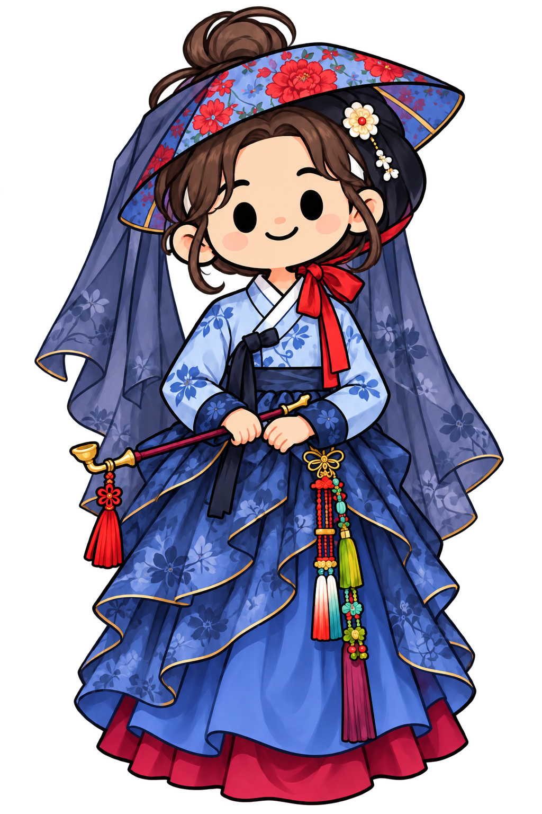
  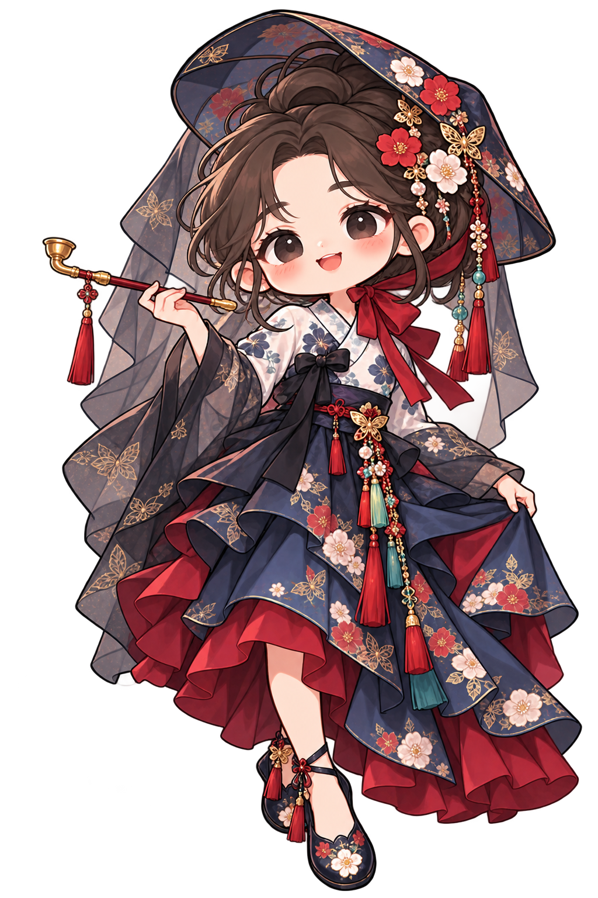
  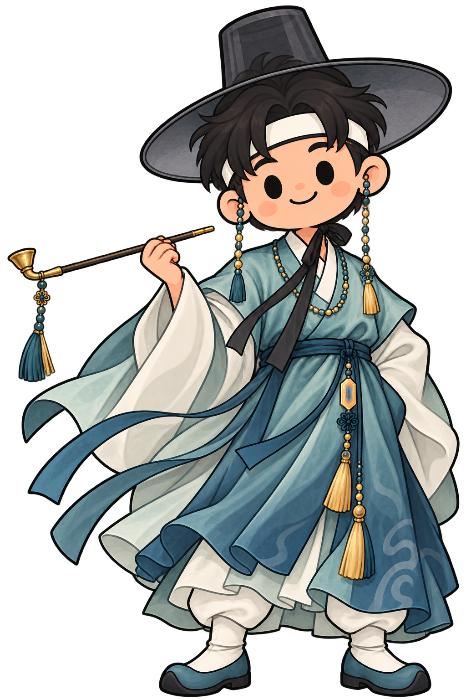
  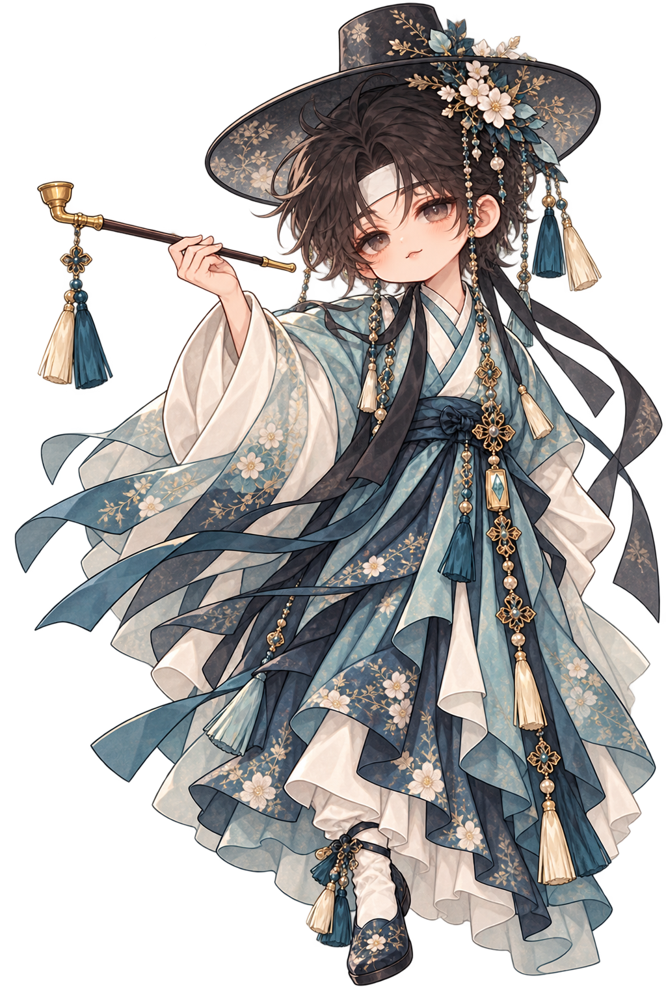
</p>

---

## Level 5 Character Outfit

Level 5 해금용 캐릭터 디자인을 위해  
겨울 / 여름 운동복과 여러 포즈 적용 시안을 제작했습니다.

<p align="center">
  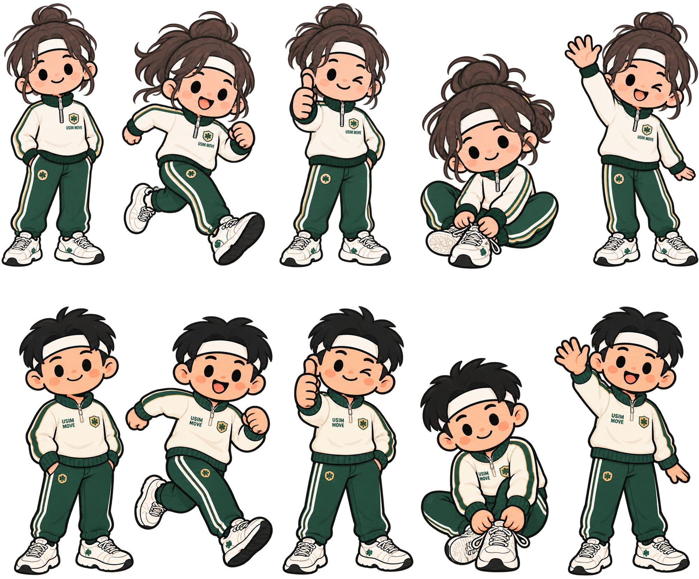
  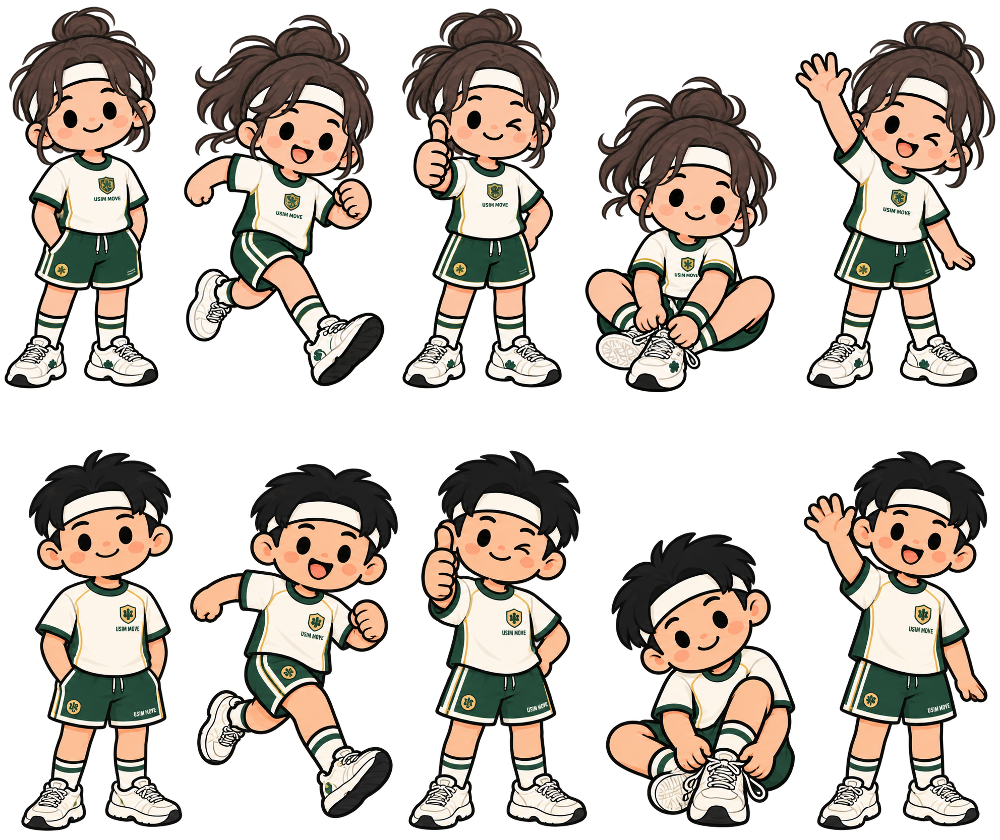
</p>

단순히 하나의 완성 캐릭터만 만드는 것이 아니라  
동일한 디자인이 여러 캐릭터와 포즈에서도 유지될 수 있도록  
운동복 형태와 배치를 반복적으로 조정했습니다.

---

## Clothing Layer Separation

커스터마이징 기능을 고려하여  
캐릭터 전체 이미지만 제작하는 방식에서 한 단계 더 나아가  
**캐릭터 본체와 의상 Asset을 분리하는 작업**도 진행했습니다.

<p align="center">
  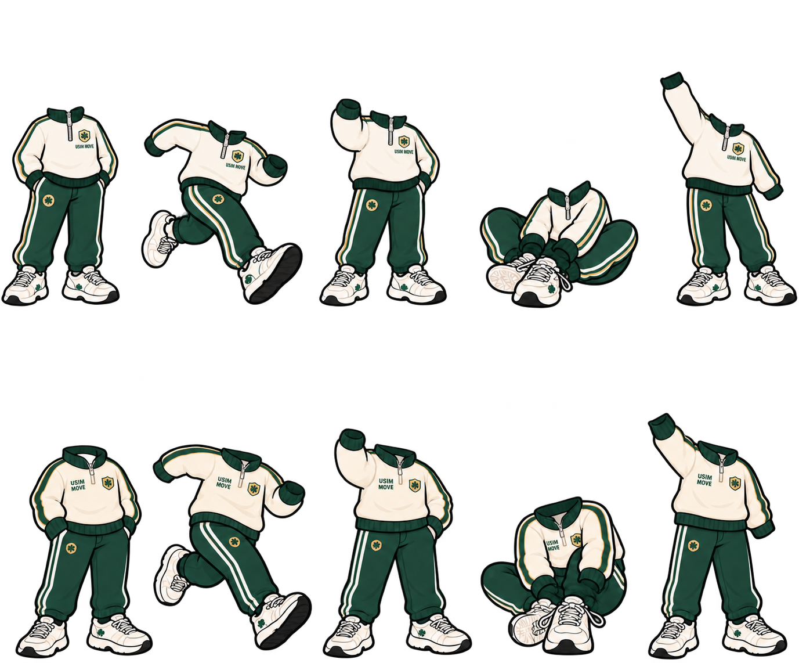
  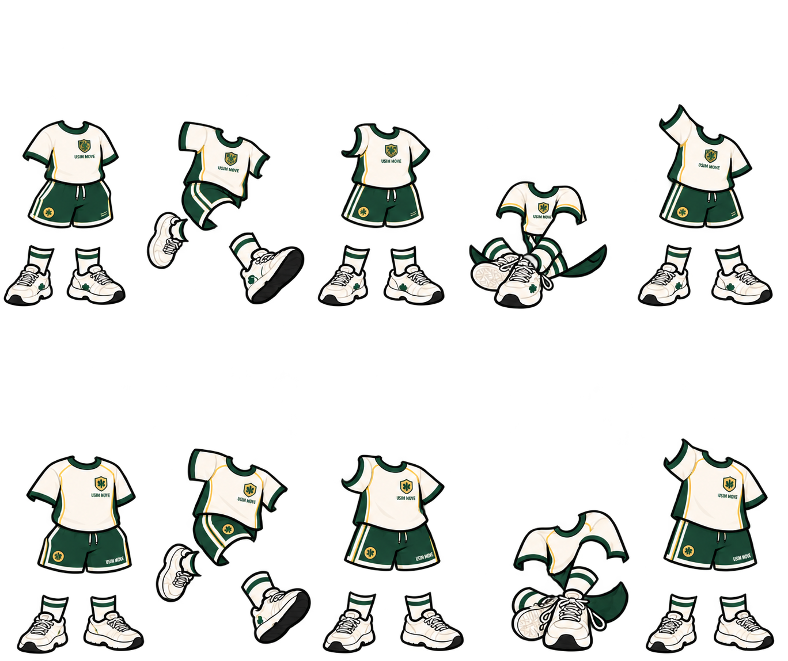
</p>

기본 구조는 다음 방향으로 검토했습니다.

```text
Character Base
      +
Clothing Layer
      ↓
Customized Character
```

캐릭터 전체 이미지를 매번 새로운 이미지로 교체하는 대신  
의상 Asset을 별도의 Layer로 관리하고  
캐릭터에 적용할 수 있는 구조를 시도했습니다.

이 과정에서는

- 캐릭터 신체와 의상 분리
- 포즈별 의상 위치 확인
- 겨울 / 여름 운동복 분리
- 기존 캔버스 크기에 맞춘 Asset 재배치
- 실제 커스터마이징 적용 가능성 검토

등을 진행했습니다.

---

## Clothes & Item Parts

캐릭터가 착용하거나 사용할 수 있는  
의류와 운동 관련 아이템을 별도 Asset 형태로 제작했습니다.

<p align="center">
  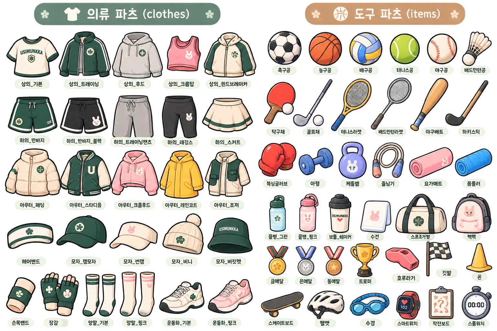
</p>

### Clothes

- 기본 상의
- 트레이닝 상의
- 후드
- 크롭탑
- 윈드브레이커
- 반바지
- 트레이닝 팬츠
- 레깅스
- 스커트
- 패딩
- 스타디움 자켓
- 후드 / 레인코트 / 조끼
- 헤어밴드
- 캡모자 / 선캡 / 비니 / 버킷햇
- 손목밴드
- 장갑
- 양말
- 운동화

### Exercise Items

- 축구공
- 농구공
- 배구공
- 테니스공
- 야구공
- 배드민턴공
- 탁구채
- 골프채
- 테니스라켓
- 배드민턴라켓
- 야구배트
- 하키스틱
- 복싱글러브
- 아령
- 케틀벨
- 줄넘기
- 요가매트
- 폼롤러

### Accessories & Rewards

- 물병
- 수건
- 스포츠가방
- 백팩
- 금 / 은 / 동메달
- 트로피
- 호루라기
- 깃발
- 콘
- 스케이트보드
- 헬멧
- 수경
- 스마트워치
- 작전보드
- 스톱워치

이 Asset들은 단순 일러스트 모음이 아니라  
향후 캐릭터 커스터마이징 화면에서

```text
캐릭터 선택
      ↓
의상 선택
      ↓
아이템 선택
      ↓
캐릭터에 적용
```

할 수 있는 형태를 염두에 두고 제작했습니다.

---

## Character Pose Assets

캐릭터가 정적인 기본 자세 하나에 머물지 않도록  
여러 동작과 포즈에 동일한 의상을 적용하는 시안도 제작했습니다.

여성 / 남성 캐릭터 각각에 대해

- 기본 자세
- 달리기
- 좋아요
- 앉아서 신발 묶기
- 손 흔들기

등의 형태를 제작하고  
의상 디자인이 포즈에 따라 어떻게 달라져야 하는지 확인했습니다.

---

## Character Redesign Preview

프로젝트 후반에는 기존 캐릭터 스타일을 확장하기 위해  
전통 의상과 색상 조합을 바탕으로 다양한 리디자인 시안을 제작했습니다.

### Concept Design

<p align="center">
  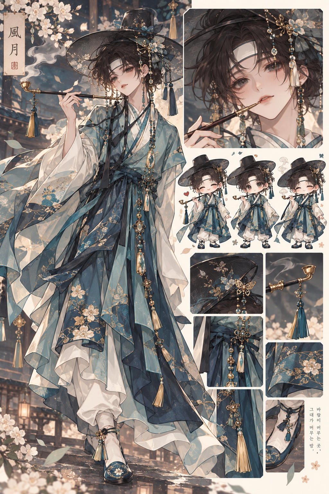
  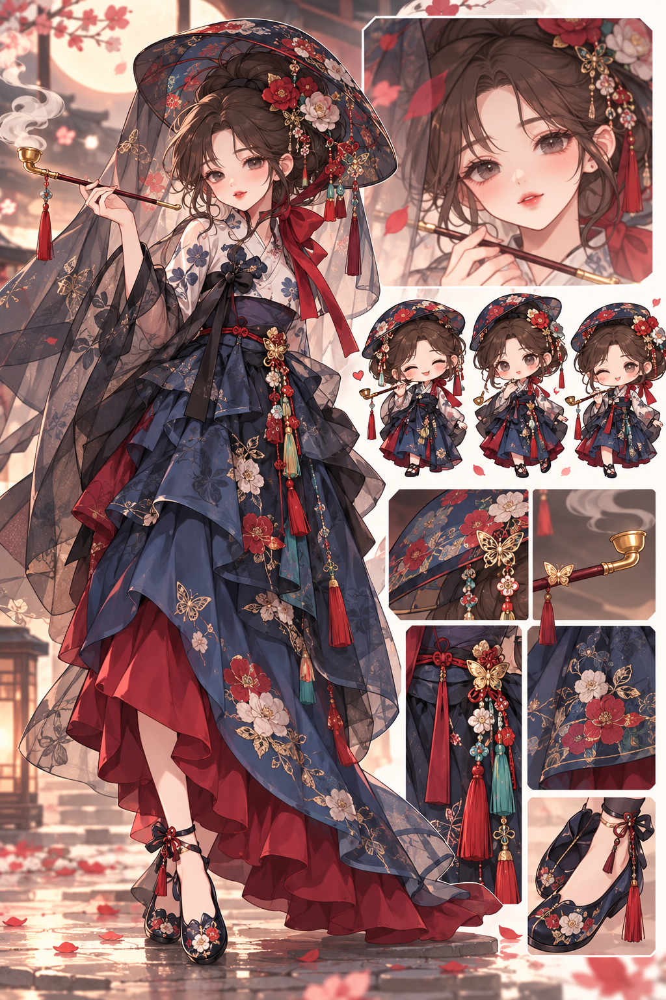
</p>

초기 Concept Sheet를 기준으로  
의상 색상, 장식, 실루엣과 캐릭터 표현 방식을 확장했습니다.

### Character Redesign

<p align="center">
  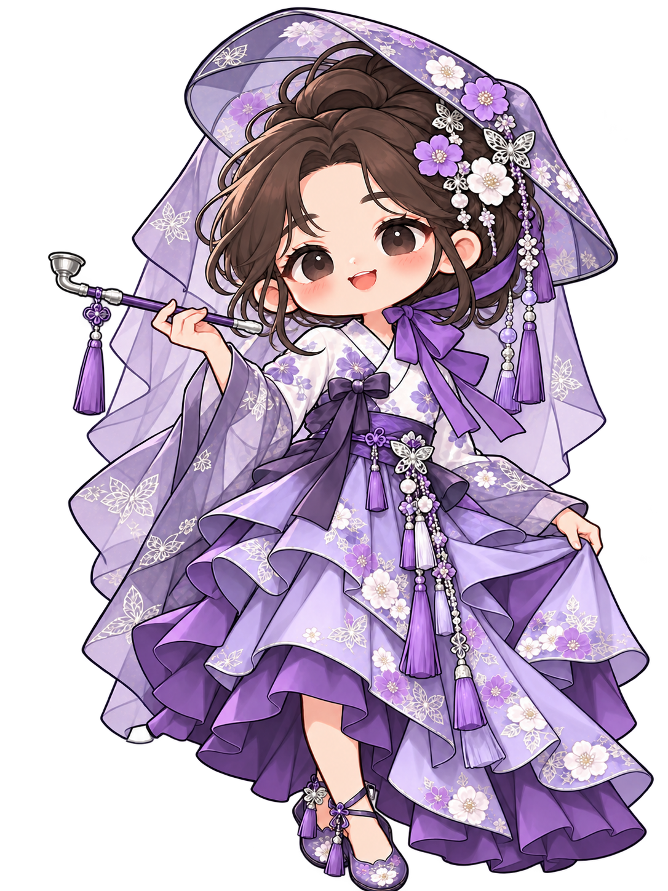
  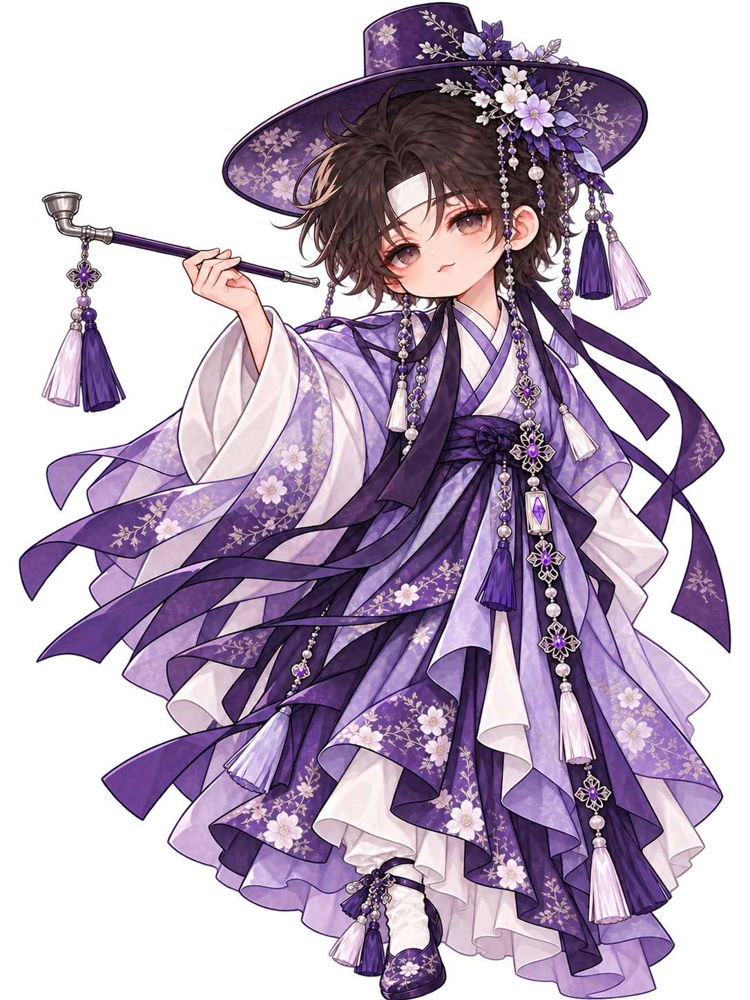
  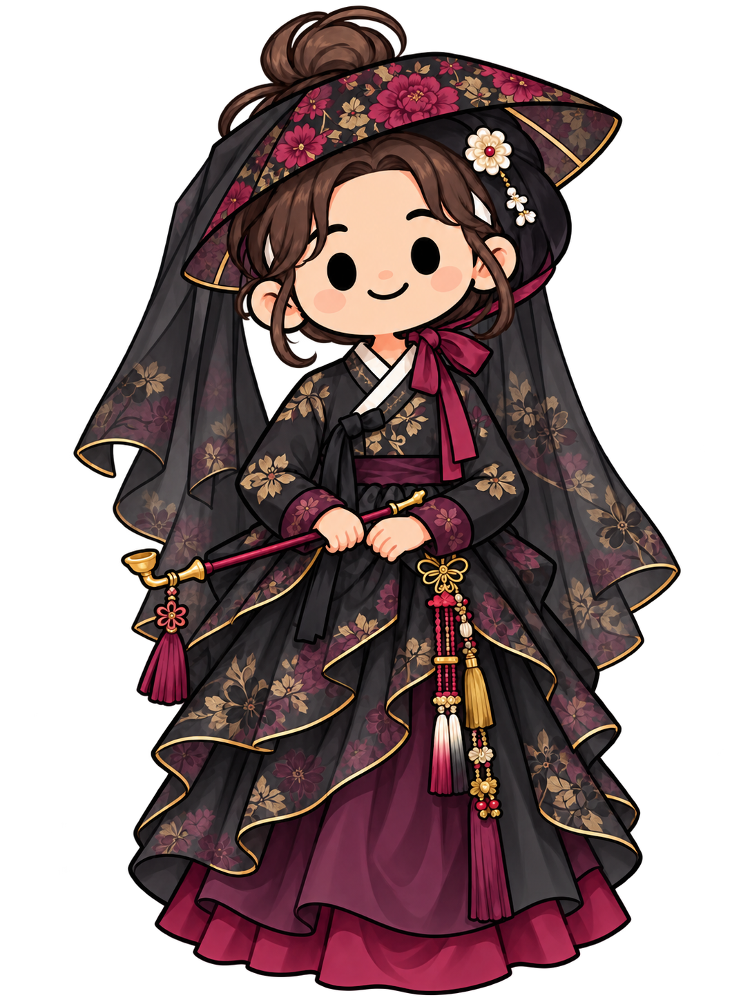
  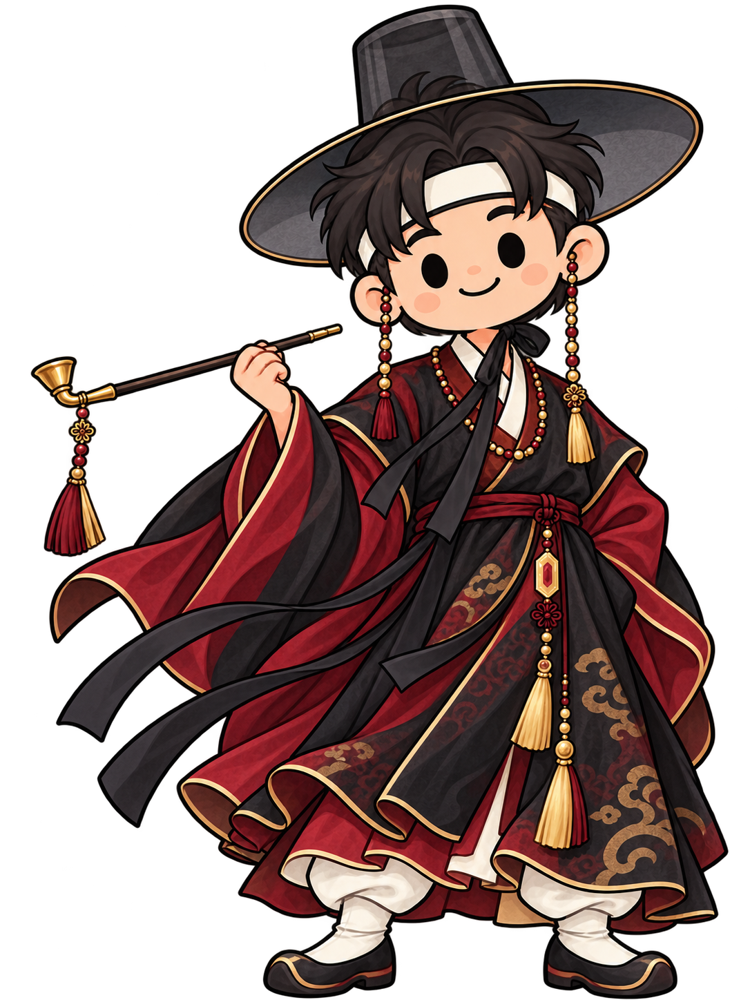
</p>

➡️ [Character Redesign Archive](./docs/visual-assets/character-redesign/)

---

# 2. Room Customization

프로젝트 후반에는 사용자가 자신의 운동방을 꾸밀 수 있도록  
여러 분위기의 방 테마와 가구 Asset을 제작했습니다.

각 테마는

```text
Room Background
      +
Furniture Assets
      ↓
Completed Room
```

형태로 구성했습니다.

### Blue Oriental

<p align="center">
  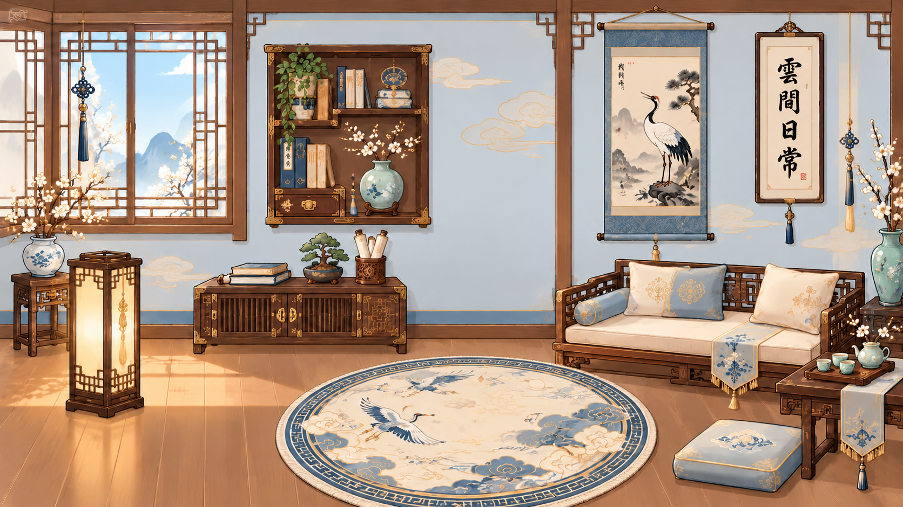
</p>

### Mint Oriental

<p align="center">
  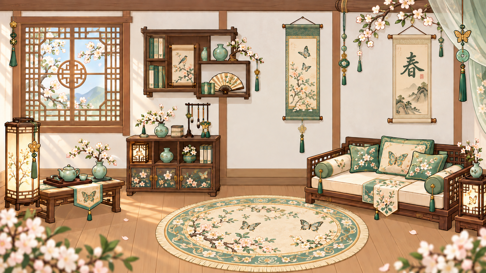
</p>

### Pink Oriental

<p align="center">
  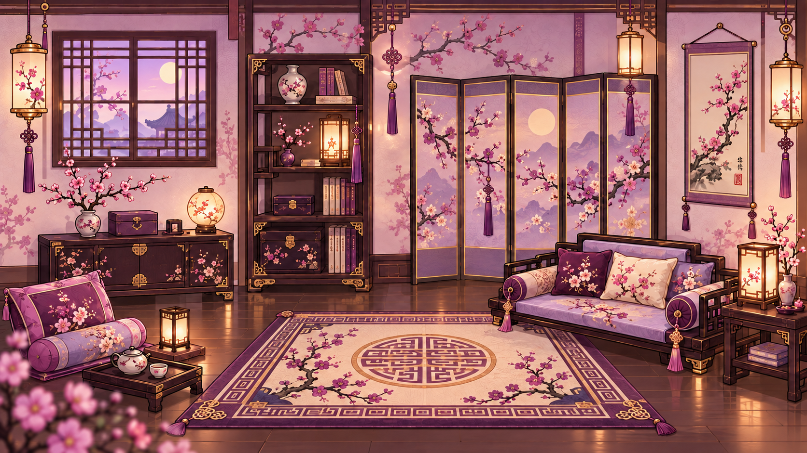
</p>

### Dark Oriental

<p align="center">
  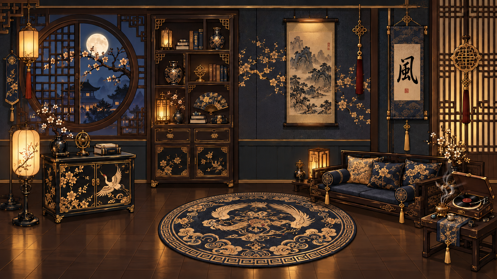
</p>

### Oriental Retro

<p align="center">
  
</p>

➡️ [Room Asset Archive](./docs/visual-assets/room-assets/)

---

# 3. Motion Test

캐릭터가 정적인 이미지에 머물지 않도록  
걷기 및 움직임 표현을 위한 프레임과 GIF 테스트도 진행했습니다.

테스트 과정에서는

- 걷기 포즈 생성
- 프레임별 신체 위치 확인
- 정면 / 측면 이동 이미지 제작
- GIF 적용 가능성 확인
- 캐릭터 외형 유지 문제 확인

등을 진행했습니다.

➡️ [Character Motion Tests](./docs/visual-assets/motion-tests/)

---

# 4. Presentation Material Development

프로젝트 발표 준비 과정에서  
발표자료 구성 및 수정 작업에도 참여했습니다.

최종 발표는 팀 공식 README를 중심으로 진행되지만,  
발표 준비 과정에서 제작한 PPT 자료는  
프로젝트 구조와 데이터 파이프라인을 이해하고 정리한 작업 기록으로 보관하고 있습니다.

발표자료는 단순한 디자인 수정이 아니라

**기술 내용을 이해하고 → 핵심을 정리하고 → 발표자가 설명할 수 있는 형태로 재구성**

하는 방향으로 작업했습니다.

---

## Presentation Revision Overview

<p align="center">
  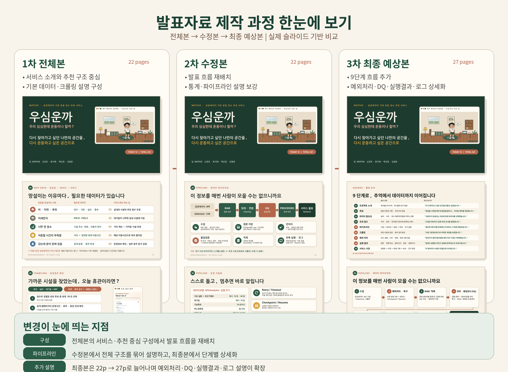
</p>

```text
Preliminary Draft
        ↓
Initial Full Version
        ↓
Revised Version
        ↓
Presenter Feedback
        ↓
Pipeline Concept Revision
        ↓
Final Expected Version
```

최종 예상본에서는

**데이터 필요성 → 추천 점수 → 데이터 파이프라인 → 크롤링 → 예외 처리 → 실행 결과 → 서비스 시연**

순서로 발표 내용을 재구성했습니다.

---

## Data Pipeline Concept Revision

발표자료 수정 과정에서  
데이터 파이프라인의 전체 구조를 다시 학습하고 정리했습니다.

```text
수집
 ↓
예외처리 · 복구
 ↓
RAW 적재
 ↓
정제 · 데이터 품질 검사(DQ)
 ↓
PROCESSED 적재
 ↓
스케줄링 · 자동화
 ↓
모니터링 · 알림
```

이 작업은 데이터 파이프라인 자체를 제가 구현했다는 의미가 아니라,  
팀 프로젝트의 구조를 이해하고 발표자료로 정리한 과정입니다.

---

## Presentation Files

### PDF

- [전체 발표자료 PDF](./docs/presentation/ppt발표자료.pdf)
- [최종 예상본 PDF](./docs/presentation/ppt발표자료%20최종예상.pdf)

### PPTX

- [발표자료 초안](./docs/presentation/우심운까_발표자료_초안.pptx)
- [전체 발표자료](./docs/presentation/우심운까_발표자료_전체.pptx)
- [전체 발표자료 수정본](./docs/presentation/우심운까_발표자료_전체-수정본.pptx)
- [최종 예상본](./docs/presentation/우심운까_발표자료_최종예상.pptx)

➡️ [Presentation Development Archive](./docs/presentation/)

---

# 5. Earlier M4 / PAGE1 Contribution

아래 내용은 프로젝트 초기  
M4 / PAGE1 담당 당시의 개발 기록입니다.

초기 PAGE1의 버전별 코드와 프로젝트 시작 과정은  
별도의 Archive 문서에 정리했습니다.

➡️ [M4 / PAGE1 Development Archive](./archive/page1-m4/)

---

## 01. 대한민국 지역 랭킹 지도

초기 PAGE1의 핵심 기능은  
대한민국 지도를 이용한 지역 운동 랭킹 시각화였습니다.

사용자가 지도를 직접 선택하면서

**“어느 지역이 더 많이 움직이고 있는가?”**

를 한 화면에서 확인할 수 있도록 구성했습니다.

주요 작업:

- 지역 Hover Interaction
- 지역명 표시
- 지역 선택 이벤트
- 지도 비율 조정
- 지역 데이터 누락 수정
- 울릉도 / 독도 표시

### PAGE1 초기 디자인

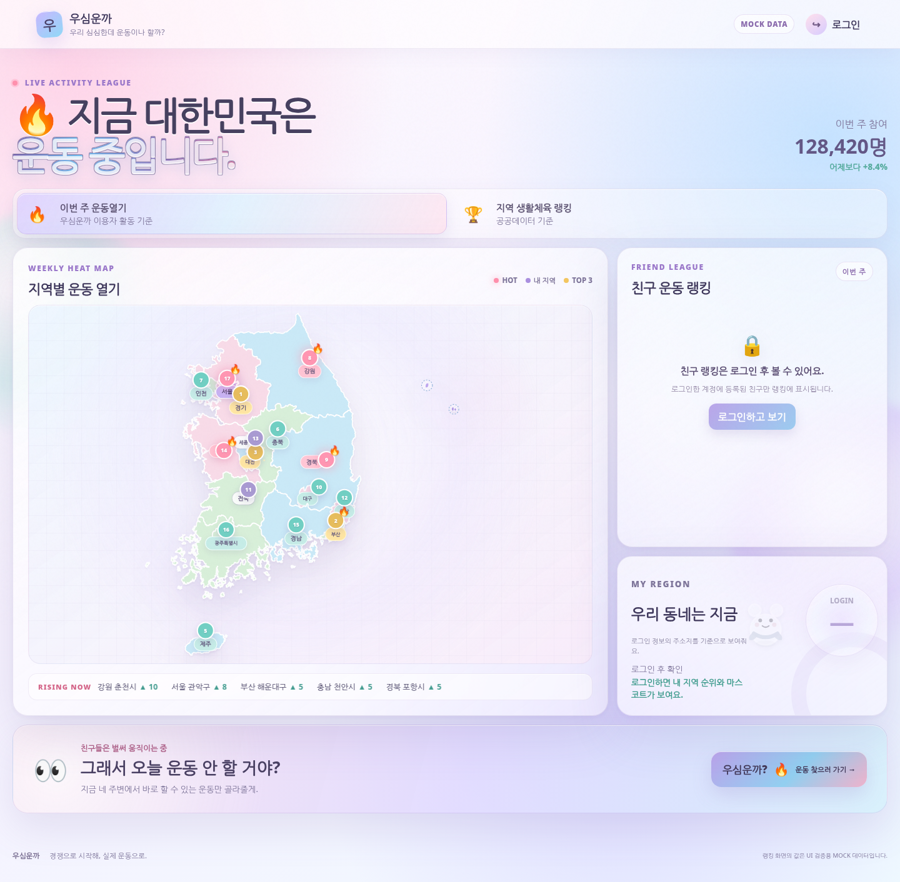

### PAGE1 컬러 및 UI 개선

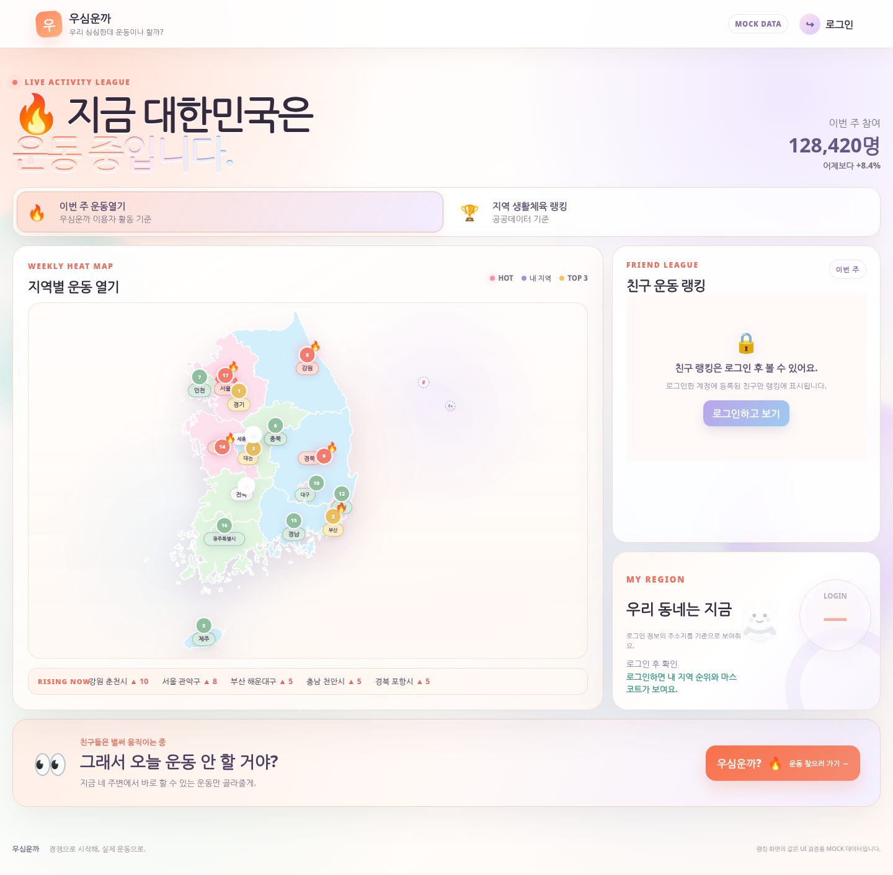

---

## 02. 지역 상세 랭킹 Popup

지도에서 특정 지역을 선택하면  
해당 지역의 시·군·구 정보를 확인할 수 있는  
Popup UI를 구성했습니다.

표현 요소:

- 지역명
- 지역 순위
- 순위 변화량
- 상승 상태
- 지역별 마스코트
- 운동추천 CTA

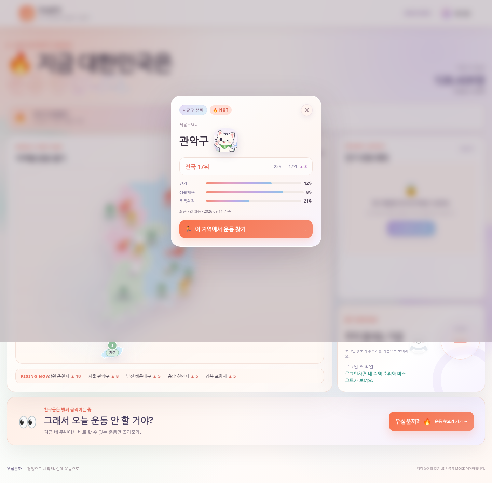

---

## 03. 랭킹 변화 시각화

운동 랭킹을 숫자로만 보여주지 않고  
데이터 상태에 따라 화면도 변화하도록 구성했습니다.

```text
Ranking Data
      ↓
State
      ↓
UI Effect
```

상승 중인 지역과 TOP1 지역을  
일반 지역과 다른 방식으로 표현했습니다.

---

## 04. TOP1 Character

지역 경쟁이라는 서비스 컨셉을 친근하게 전달하기 위해  
지역 마스코트와 캐릭터 연출을 활용했습니다.

전국 1위 지역에는

- TOP1 Badge
- Trophy / Medal
- Character Highlight
- Popup Animation

등을 적용했습니다.

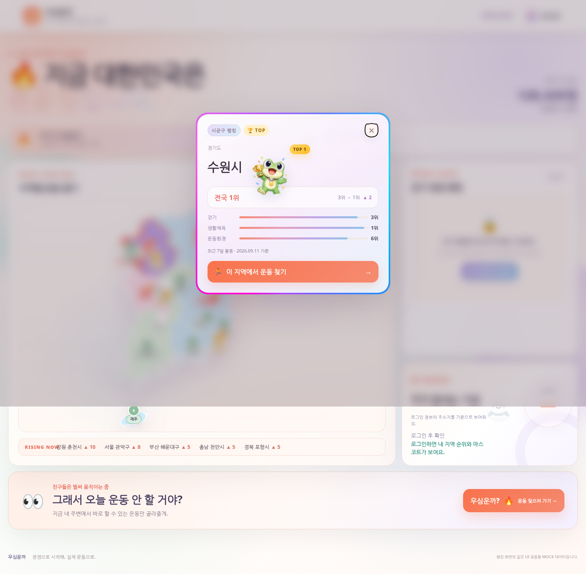

---

## 05. 운동추천 CTA

PAGE1이 단순한 랭킹 화면에서 끝나지 않고  
실제 운동 행동으로 이어지도록 CTA를 구성했습니다.

대표 메시지:

> **그래서 오늘 운동 안 할 거야?**

추천 화면 진입 방식은 두 가지로 나눴습니다.

### 현재 위치 기반 추천

사용자의 현재 위치를 기준으로 추천 화면으로 이동.

### 원하는 지역 기반 추천

사용자가 원하는 지역을 직접 선택한 뒤  
해당 위치를 기준으로 추천 화면으로 이동.

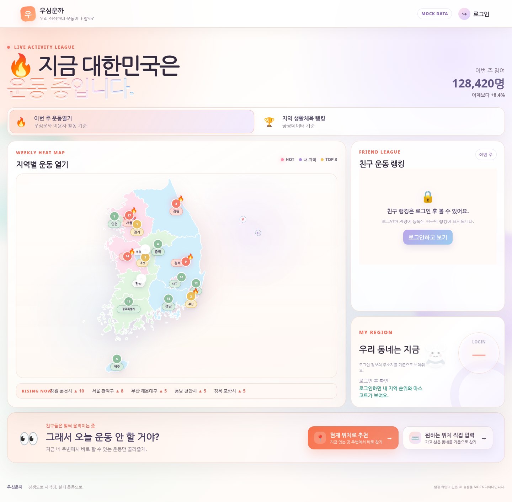

> 초기 연결본에서는 실제 추천 로직 및 위치 API 전체를 구현한 것이 아니라  
> PAGE1에서 추천 화면으로 이동하는 CTA와 선택 흐름을 중심으로 작업했습니다.

---

## 06. 팀 통합 이후 변화

프로젝트 후반부에는 팀 전체 UI와 서비스 구조가 변경되었습니다.

초기:

```text
대한민국 지도
→ 지역 경쟁
→ 운동추천
```

최종:

```text
HOME
→ MOVE
→ DIARY
→ FRIENDS
→ PROFILE
```

따라서 초기 PAGE1 화면 자체가  
최종 서비스에 그대로 남아 있는 것은 아닙니다.

이 저장소에서는 이 차이를 숨기지 않고

**초기 담당 구현과 최종 통합 이후 참여 범위를 구분하여 기록합니다.**

---

## 07. Character Gender UI

프로젝트 후반에는  
캐릭터 성별 선택 UI와 화면 연동 수정에도 참여했습니다.

프로필에서 선택한 캐릭터 타입이

- PROFILE
- HOME
- MOVE

등의 화면에서 연결될 수 있도록  
Frontend 흐름을 함께 수정했습니다.

```text
FEMALE CHARACTER
        ↕
CHARACTER TYPE
        ↕
MALE CHARACTER
```

---

# 6. Development Process

이 프로젝트는 한 번에 완성된 화면을 만든 것이 아니라

```text
요구사항 확인
      ↓
Prototype
      ↓
문제 발견
      ↓
수정
      ↓
팀 공유
      ↓
통합
      ↓
재수정
```

과정을 반복하며 개발했습니다.

특히 팀 프로젝트에서는  
제가 구현한 화면이 다른 팀원의 코드와 병합되고  
전체 디자인 시스템과 서비스 구조가 변경되면서  
최종 코드의 형태도 크게 달라지는 경험을 했습니다.

이 과정을 통해

> 최종 코드에 몇 줄이 남아 있는가보다  
> 프로젝트에서 어떤 문제를 맡아 해결했는가가 중요하다

는 점을 배웠습니다.

---

# 7. Codex / VS Code Workflow

프로젝트 후반에는  
VS Code와 Codex를 활용해 Frontend 및 Asset 관련 작업을 보조했습니다.

Codex에 작업을 전달할 때는  
전체 프로젝트를 한 번에 수정하도록 하기보다

```text
현재 문제 확인
      ↓
수정 범위 정리
      ↓
필요한 파일 / 기능 지정
      ↓
작업 요청
      ↓
결과 확인
      ↓
필요한 부분 재수정
```

과정을 사용했습니다.

특히 캐릭터 커스터마이징 작업에서는  
완성 이미지 전체를 다시 만드는 방식보다

- 캐릭터와 의상 Layer 분리
- 적용 대상 파일 확인
- Asset 경로 확인
- 수정 범위 제한
- 기존 디자인 유지

등을 먼저 정리한 뒤 작업을 진행했습니다.

---

## Codex Account / Workspace Troubleshooting

Codex 사용 과정에서는  
개인 계정과 교육용 Workspace 간 로그인 전환 문제도 경험했습니다.

개인 계정으로 연결된 상태에서 작업이 진행되어  
의도하지 않은 계정의 사용량이 소비되는 문제가 발생했고,

```text
현재 로그인 계정 확인
      ↓
Codex 세션 로그아웃
      ↓
계정 연결 상태 확인
      ↓
Workspace 전환
      ↓
작업 환경 재확인
```

과정을 거쳐 개발 환경을 다시 정리했습니다.

이 경험을 통해 AI 개발 도구를 사용할 때도

- 현재 로그인 계정
- Workspace
- 작업 대상 저장소
- 수정 파일
- 요청 범위

를 먼저 확인해야 한다는 점을 배웠습니다.

---

## Prompt Scope Management

이미지 Asset이나 Frontend 파일을 수정할 때  
불필요한 반복 작업과 사용량을 줄이기 위해  
작업 요청 자체도 점차 구체적으로 작성했습니다.

예를 들어 단순히

```text
캐릭터 커스터마이징 수정
```

이라고 요청하는 대신

```text
현재 캐릭터 구조 유지
→ 의상 Layer만 분리
→ 기존 캐릭터 크기 유지
→ 지정된 Asset만 수정
→ 나머지 파일은 변경하지 않음
```

처럼 범위를 먼저 정의하는 방식으로 변경했습니다.

Codex는 프로젝트를 대신 완성하는 도구라기보다  
**수정 범위를 명확하게 전달하고 결과를 검토하면서 사용하는 개발 보조 도구**로 활용했습니다.

---

# 8. Troubleshooting

## 지도 비율 문제

### Problem

화면 크기에 따라 대한민국 지도 형태가 찌그러지는 문제가 발생했습니다.

### Solution

SVG ViewBox와 부모 컨테이너의 비율,  
반응형 크기 설정을 조정했습니다.

---

## 지역 데이터 누락

### Problem

일부 지역이 지도 또는 랭킹에서 누락되는 문제가 발생했습니다.

### Solution

지역 데이터와 지도 요소의 매핑을 확인하고  
누락된 지역 정보를 보완했습니다.

---

## Popup Interaction

### Problem

Popup 크기, Hover 효과, Border Animation이  
의도한 영역과 다르게 표현되는 문제가 있었습니다.

### Solution

Popup 구조와 CSS Layer를 반복적으로 수정했습니다.

---

## Login Routing

### Problem

같은 운동추천 CTA라도  
로그인 여부에 따라 이동 경로가 달라야 했습니다.

### Solution

```text
비로그인
→ 로그인 화면

로그인
→ 운동추천 화면
```

으로 사용자 상태에 따른 흐름을 분리했습니다.

---

# Tech Stack

### Frontend

- HTML
- CSS
- JavaScript
- Django Templates

### Development Tools

- VS Code
- Git
- GitHub
- Codex

### Collaboration

- GitHub
- Team-based Development

### Project Environment

- Python
- Django
- PostgreSQL

> Backend와 데이터 파이프라인 전체를 제가 구현했다는 의미가 아니며,  
> 위 기술은 팀 프로젝트의 전체 실행 환경을 포함합니다.

---

# Contribution Scope

## 직접 담당

### 초기 M4 / PAGE1

- 대한민국 지역 지도
- 지역 랭킹 UI
- 지역 상세 Popup
- 지역 마스코트
- TOP1 UI
- 친구 랭킹 화면
- 운동추천 CTA
- PAGE1 Interaction
- 위치 선택 CTA 흐름
- 반응형 PAGE1

---

## 팀 통합 과정에서 참여 / 개선

### Final Frontend & Visual

- 사용자 화면 및 UX 수정
- 캐릭터 성별 선택 UI 및 화면 연동
- 한복 및 전통 의상 캐릭터 Visual Asset
- Level 5 운동복 디자인
- 겨울 / 여름 캐릭터별 운동복 Asset
- 캐릭터 본체 / 의상 Layer 분리
- 의류 및 운동 도구 Parts Asset
- 캐릭터 디자인 변형 시안
- 포즈별 캐릭터 이미지
- 운동방 테마 및 가구 Asset
- Motion Test 및 GIF 제작
- 현재 위치 / 지역 선택 기반 추천 UX 검토

### Development Workflow

- VS Code 기반 Frontend 작업
- Git / GitHub 버전 관리
- Codex 작업 보조 활용
- 수정 범위를 제한한 작업 요청
- Codex 계정 / Workspace 연결 문제 해결 경험

### 발표자료 준비

- 프로젝트 전체 발표자료 구성 및 수정
- 데이터 파이프라인 개념 정리
- 기술 내용의 발표용 문장·도식 재구성
- 발표자 요청에 따른 내용·순서·표현 수정

---

## Contribution Boundary

다음 영역은 다른 팀원의 주요 담당 영역입니다.

- Django Backend 전체
- 추천 알고리즘 전체
- 공공데이터 수집 Pipeline 전체
- Database 설계 전체

해당 기술을 발표자료 정리나 Frontend 연결 과정에서 확인한 적은 있지만  
개인 구현 범위로 주장하지 않습니다.

---

# Repository Structure

```text
.
├─ README.md
│
├─ archive/
│  └─ page1-m4/
│     ├─ 2026-09-11-core/
│     ├─ 2026-09-11-v3/
│     ├─ 2026-09-14-final/
│     └─ 04_region_popup_CTA_2026-09-14/
│
├─ docs/
│  ├─ screenshots/
│  │
│  ├─ presentation/
│  │  ├─ README.md
│  │  ├─ presentation_revision_overview.png
│  │  ├─ 우심운까_발표자료_초안.pptx
│  │  ├─ 우심운까_발표자료_전체.pptx
│  │  ├─ 우심운까_발표자료_전체-수정본.pptx
│  │  ├─ 우심운까_발표자료_최종예상.pptx
│  │  └─ PDF Export Files
│  │
│  ├─ visual-assets/
│  │  ├─ character_parts_catalog.png
│  │  ├─ lv5_winter_all_poses.png
│  │  ├─ lv5_summer_all_poses.png
│  │  ├─ lv5_winter_clothing_only_sheet.png
│  │  ├─ lv5_summer_clothing_only_sheet.png
│  │  ├─ character-redesign/
│  │  ├─ motion-tests/
│  │  └─ room-assets/
│  │     ├─ blue-oriental/
│  │     ├─ mint-oriental/
│  │     ├─ pink-oriental/
│  │     ├─ dark-oriental/
│  │     └─ oriental-retro/
│  │
│  └─ CONTRIBUTION_EVIDENCE.md
│
└─ final-integration/
   └─ README.md
```

---

# More Details

- [Team Project](https://github.com/encore-ai-campus/mlo-02-p1-team3)
- [Final Frontend Integration](./final-integration/README.md)
- [Character & Visual Asset Contribution](./docs/visual-assets/)
- [Character Redesign Archive](./docs/visual-assets/character-redesign/)
- [Room Customization Assets](./docs/visual-assets/room-assets/)
- [Presentation Development Archive](./docs/presentation/)
- [M4 / PAGE1 Contribution Archive](./archive/page1-m4/)
- [Contribution Evidence](./docs/CONTRIBUTION_EVIDENCE.md)

---

# Repository Notice

본 저장소의 초기 PAGE1 화면은  
팀 통합 이전 제가 M4를 담당하던 시점의 작업물입니다.

이후 팀 프로젝트의 방향과 Frontend 구조가 변경되면서  
현재 최종 서비스와 디자인 및 기능 구성이 달라졌습니다.

최종 서비스의 전체 구조와 발표 내용은  
팀 공식 저장소 README를 기준으로 확인할 수 있습니다.

➡️ [우심운까 Team Repository](https://github.com/encore-ai-campus/mlo-02-p1-team3)

따라서 이 저장소는

**현재 우심운까 전체 서비스의 복제본**

이 아니라

**팀 프로젝트에서 제가 담당하고 참여했던 Frontend 개발 과정,  
Visual Asset 제작, 개발 도구 활용, 발표자료 구성 및 수정 과정을 기록한 개인 기여 아카이브**

입니다.

팀 프로젝트의 다른 구성원이 담당한 기능을  
개인 작업으로 표현하지 않습니다.
