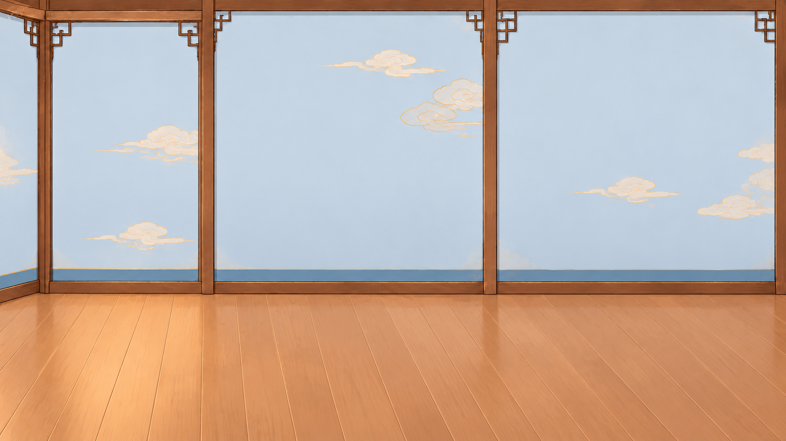
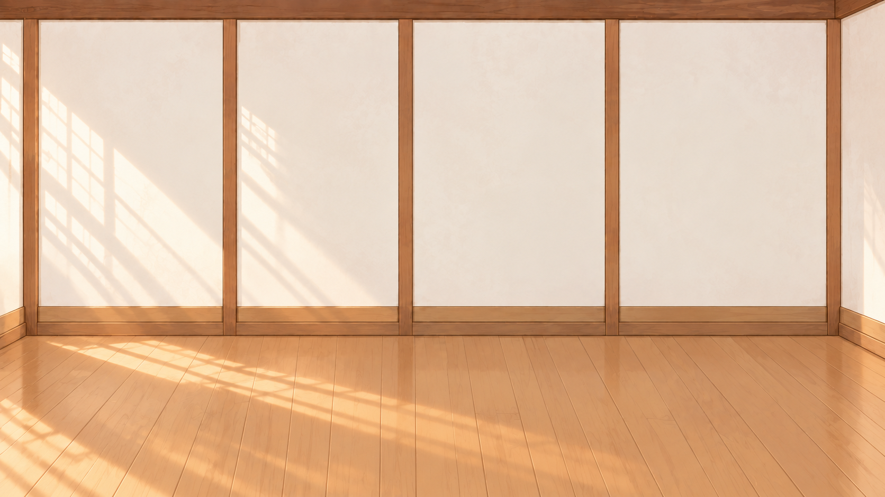
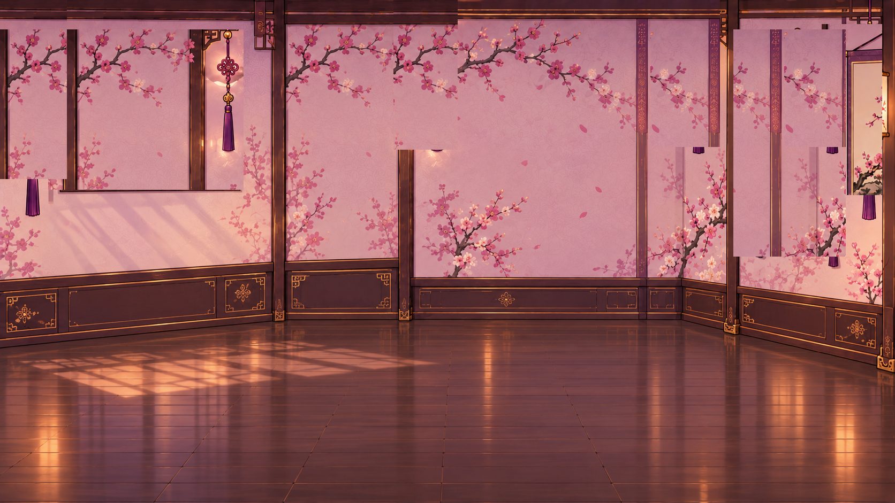
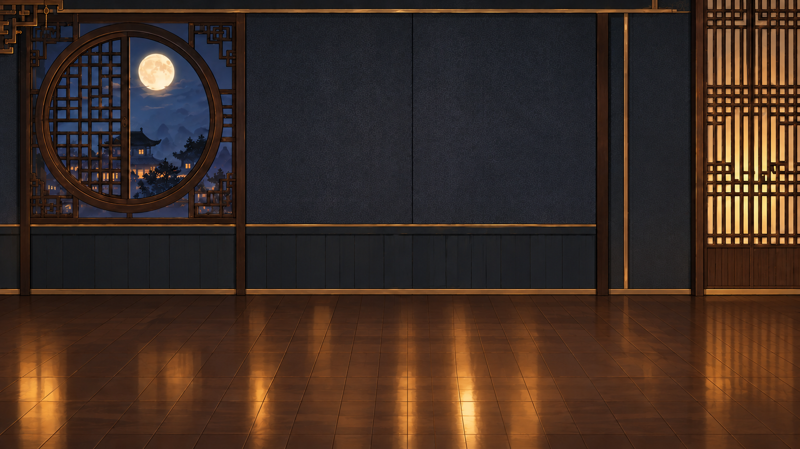
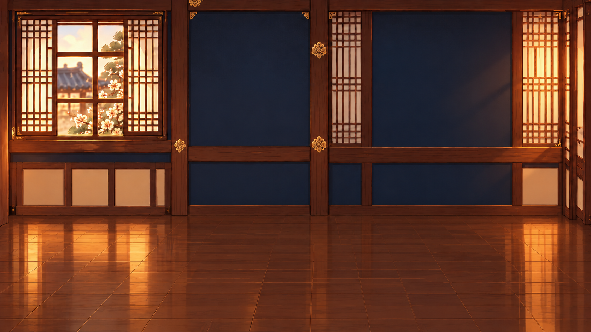

# 우심운까 | Frontend Contribution Archive 🏃

### 우리 심심한데 운동이나 할까?

지역·운동 취향·현재 상황을 바탕으로 운동 장소를 추천하고,  
운동 기록과 캐릭터·운동방·친구 기능을 통해  
다음 운동으로 다시 이어지도록 설계한 생활체육 웹 서비스입니다.

> 이 저장소는 팀 프로젝트 **「우심운까」 전체를 개인 프로젝트로 복제한 저장소가 아닙니다.**
>
> 프로젝트 개발 과정에서 제가 담당하거나 직접 수정·개선한  
> **M4 / PAGE1 및 Frontend 관련 작업을 기록하기 위한 개인 기여 아카이브**입니다.

---

## Project

**우심운까 (WoosimWoonkka)**  
우리 심심한데 운동이나 할까?

운동을 하려고 마음먹은 사용자가

**운동할 곳 탐색 → 선택 → 실제 운동 → 기록 → 보상 → 재참여**

까지 자연스럽게 이어갈 수 있도록 만든 팀 프로젝트입니다.

초기에는 지역 및 친구 간 운동 경쟁을 활용한  
**지역 랭킹 PAGE1**을 중심으로 개발을 시작했습니다.

이후 팀 통합 과정에서 서비스 구조가 변경되면서  
최종 서비스는 다음과 같은 사용자 흐름을 중심으로 발전했습니다.

`HOME → MOVE → DIARY → FRIENDS → PROFILE`

따라서 이 저장소에는 다음 내용을 구분하여 기록합니다.

1. 제가 담당했던 초기 **M4 / PAGE1 구현 기록**
2. 팀 통합 이후 Frontend에서 제가 참여한 작업
3. 개발 과정에서 발생한 문제와 수정 과정
4. 직접 제작하거나 수정한 Visual Asset 및 Motion Test

---

# My Role

## Frontend · M4 / PAGE1

초기 역할 분담에서 **M4 / PAGE1 Frontend**를 담당했습니다.

PAGE1의 목적은 단순히 지역 순위를 보여주는 것이 아니라,

**지역 경쟁을 보여주고 → 운동 동기를 만들고 → 운동추천 화면으로 연결하는 것**

이었습니다.

### 초기 M4 담당 범위

- 대한민국 지역 지도 UI
- 지역별 운동 랭킹 시각화
- 시·군·구 상세 랭킹 Popup
- 내 지역 상태 표시
- 상승 지역 및 상위 지역 강조
- 친구 운동 랭킹 UI
- 지역 마스코트 연동
- TOP1 캐릭터 강조
- 지도 Hover / Popup Interaction
- 운동추천 CTA
- 로그인 상태에 따른 CTA 이동 분기
- 현재 위치 / 사용자 지정 위치 추천 CTA·선택 흐름
- Mock 데이터 및 API 교체를 고려한 Frontend 구조
- 반응형 PAGE1 UI

---

# Final Frontend & Visual Contribution

초기 M4 / PAGE1 작업 이후에도  
팀 통합 과정에서 Frontend UI와 Visual Asset 작업에 참여했습니다.

프로젝트 후반에는 초기 지역 경쟁 화면과 별개로  
캐릭터 커스터마이징, 캐릭터 디자인 변형, 방 꾸미기 테마,  
Motion Test 등 최종 서비스의 시각적 경험을 확장하는 작업을 진행했습니다.

## Character Customization

여성 / 남성 캐릭터를 기반으로  
한복 및 전통 의상 콘셉트와 다양한 캐릭터 디자인 시안을 제작했습니다.

<p align="center">
  
  
  
  
</p>

Level 5 해금용 캐릭터 디자인과  
계절별 운동복 및 포즈 적용 시안도 제작했습니다.

<p align="center">
  
  
</p>

➡️ [Character Redesign Archive](./docs/visual-assets/character-redesign/)

---

## Room Customization

프로젝트 후반에는 사용자가 자신의 운동방을 꾸밀 수 있도록  
여러 분위기의 방 테마와 가구 Asset을 제작했습니다.

### Blue Oriental

<p align="center">
  
</p>

### Mint Oriental

<p align="center">
  
</p>

### Pink Oriental

<p align="center">
  
</p>

### Dark Oriental

<p align="center">
  
</p>

### Oriental Retro

<p align="center">
  
</p>

각 테마는 방 배경과 개별 가구 Asset을 활용할 수 있도록 구성했습니다.

➡️ [Room Asset Archive](./docs/visual-assets/room-assets/)

---

## Motion Test

캐릭터가 정적인 이미지에 머물지 않도록  
걷기 및 움직임 표현을 위한 프레임과 GIF 테스트도 진행했습니다.

➡️ [Character Motion Tests](./docs/visual-assets/motion-tests/)

---

# Earlier M4 / PAGE1 Contribution

아래 내용은 프로젝트 초기 M4 / PAGE1 담당 당시의 개발 기록입니다.

## 01. 대한민국 지역 랭킹 지도

초기 PAGE1의 핵심 기능은  
대한민국 지도를 이용한 지역 운동 랭킹 시각화였습니다.

단순한 순위표 대신 사용자가 지도를 직접 선택할 수 있도록 구성하여

**“어느 지역이 더 많이 움직이고 있는가?”**

를 한 화면에서 확인할 수 있도록 했습니다.

지역 Hover Interaction,  
지역 이름 표시,  
지역 선택 이벤트 등을 적용했습니다.

개발 과정에서는 지도 비율과 지역 데이터 누락 문제를  
반복적으로 확인하고 수정했습니다.

울릉도와 독도도 지도 표시 범위에 포함했습니다.

---

### 당시 구현 화면

#### PAGE1 초기 디자인


#### PAGE1 컬러 및 UI 개선


---

## 02. 지역 상세 랭킹 Popup

지도에서 특정 지역을 선택하면  
해당 지역의 시·군·구 정보를 확인할 수 있는  
상세 Popup UI를 구성했습니다.

Popup에서는 다음 정보를 표현하도록 했습니다.

- 지역명
- 지역 순위
- 순위 변화량
- 상승 상태
- 지역별 마스코트
- 운동추천 화면 이동 CTA

### 지역 Popup


---

## 03. 랭킹 변화 시각화

운동 랭킹을 단순한 숫자로만 보여주지 않고  
사용자가 변화 상태를 시각적으로 느낄 수 있도록 구성했습니다.

상승 중인 지역에는 별도의 강조 효과를 적용하고,  
1위 지역은 일반 지역과 다른 상태로 표현했습니다.

랭킹 데이터의 상태에 따라 UI가 달라질 수 있도록 구성하여

**데이터 → UI 변화**

가 자연스럽게 연결되는 화면을 만들고자 했습니다.

---

## 04. TOP1 Character

지역 경쟁이라는 서비스 컨셉을  
조금 더 친근하게 전달하기 위해  
지역 마스코트와 캐릭터 연출을 활용했습니다.

특히 전국 1위 지역에는

- TOP1 Badge
- Trophy / Medal
- Character Highlight
- Popup Animation

등을 적용하여 일반 지역과 구분했습니다.

### TOP1 Popup


---

## 05. 운동추천 CTA

PAGE1의 목적은 순위를 보여주는 것에서 끝나는 것이 아니라  
사용자가 실제 운동 행동으로 이동할 수 있도록 연결하는 것이었습니다.

대표 메시지로

> **그래서 오늘 운동 안 할 거야?**

를 사용하고 운동추천 CTA를 배치했습니다.

이후 추천 화면으로 이동하는 방식을 두 가지로 분리했습니다.

### 현재 위치 기반 추천

사용자의 현재 위치를 기준으로  
추천 화면으로 이동할 수 있는 흐름을 구성했습니다.

### 원하는 지역 기반 추천

사용자가 원하는 지역을 직접 선택한 뒤  
해당 지역을 기준으로 추천 화면으로 이동할 수 있도록 구성했습니다.


이 위치 선택 개념은 이후 최종 서비스의 MOVE 화면에서도

**지역 선택 / 현재 위치**

두 가지 방식으로 이어졌습니다.

> 초기 연결본에서는 실제 추천 로직 및 현재 위치 기반 API 실행이 완성된 상태가 아니었으며,  
> PAGE1에서 추천 화면으로 이동하는 CTA와 선택 흐름을 중심으로 작업했습니다.

---

## 06. 팀 통합 이후 Frontend 변경

프로젝트 후반부에는 팀 전체 UI와 서비스 구조가 크게 변경되었습니다.

초기 M4의

`대한민국 지도 → 지역 경쟁 → 운동추천`

중심 구조에서,

최종 서비스는

`HOME → MOVE → DIARY → FRIENDS → PROFILE`

형태로 재구성되었습니다.

따라서 초기 PAGE1 화면 자체가  
현재 최종 서비스에 그대로 남아 있는 것은 아닙니다.

본 저장소에서는 이 차이를 숨기지 않고

**초기 담당 구현과 최종 통합 이후 참여 범위를 구분하여 기록합니다.**

---

## 07. 최종 Frontend 통합 단계 참여

후반 Frontend 통합 과정에서도  
사용자 화면과 UX 수정에 참여했습니다.

팀 최종 저장소에서는 역할이

**Frontend · 발표자료**

로 구분되어 있으며,

서비스 화면 구현 및 사용자 경험 구성을  
Frontend 팀원과 함께 진행했습니다.

### Character Gender UI

프로젝트 후반에는  
캐릭터 성별 선택 UI와 화면 연동 수정에 참여했습니다.

프로필에서 선택한 캐릭터 타입이

- PROFILE
- HOME
- MOVE

등의 캐릭터 이미지에 연결될 수 있도록 하는  
Frontend 흐름을 함께 수정했습니다.

```text
FEMALE CHARACTER
        ↕
CHARACTER TYPE
        ↕
MALE CHARACTER
