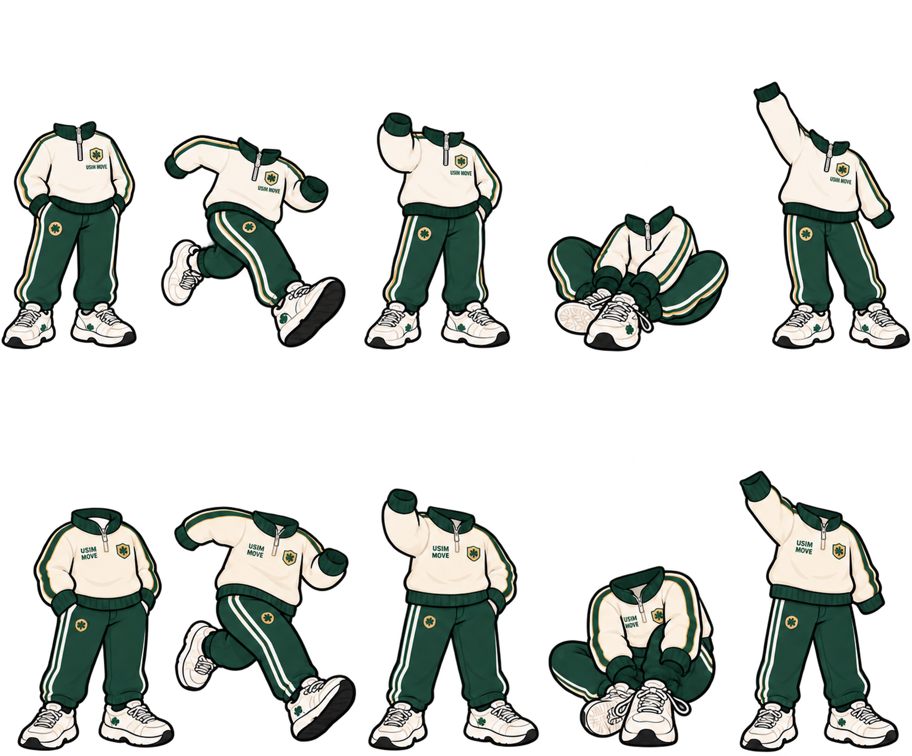
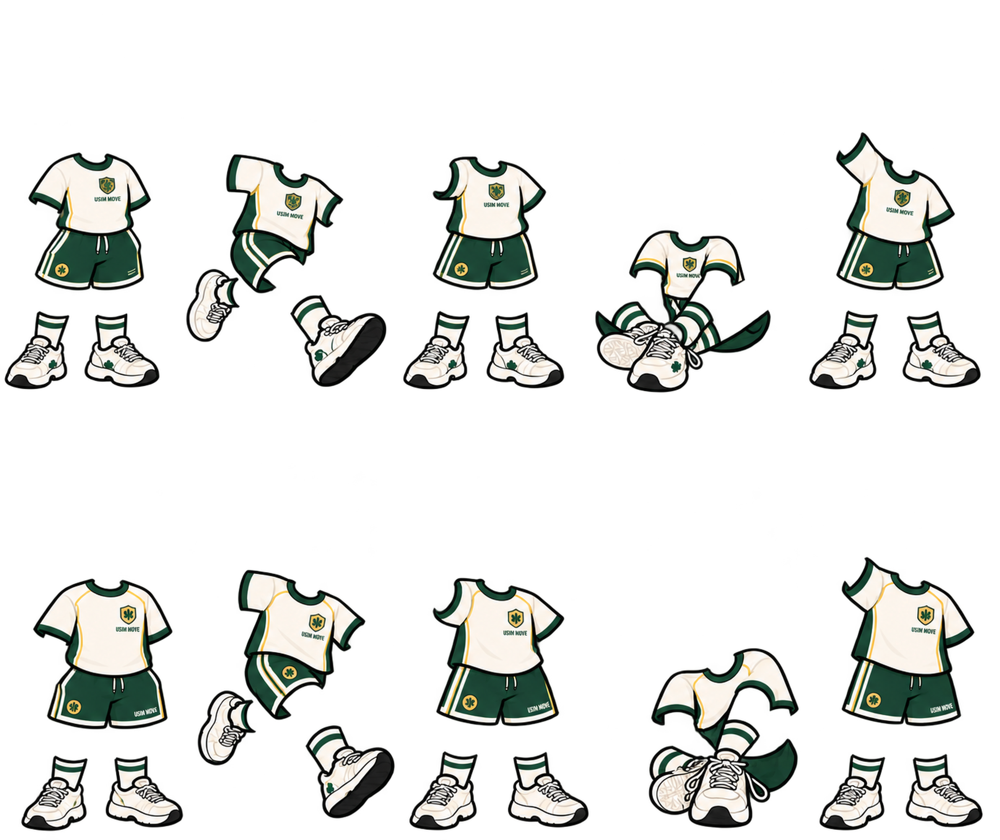

# Visual Asset Contribution

우심운까 프로젝트 후반부에서 제작하거나 수정한
캐릭터 및 커스터마이징용 이미지 자산을 정리한 폴더입니다.

## Contribution

- 한복 캐릭터 디자인
- 레벨 5 해금용 운동복 시안
- 겨울 / 여름 의상 시트
- 포즈별 의상 적용 이미지
- 캐릭터와 의상을 분리하기 위한 의상 전용 PNG 제작
- 남성 / 여성 캐릭터 포즈 시안
- 걷기 및 움직임 테스트 이미지 / GIF 제작

> 팀 전체 Visual Asset 중 제가 직접 제작·수정한 자료만 이 폴더에 정리합니다.
---

## Hanbok Character Assets

프로젝트 후반부 캐릭터 커스터마이징 과정에서 제작한
한복 캐릭터 이미지입니다.

| Female | Female Variant |
|---|---|
|  |  |

| Male | Male Variant |
|---|---|
|  |  |

---

## Level 5 Clothing Assets

레벨 5 해금용 운동복을 포즈별 캐릭터에 적용하고,
실제 커스터마이징 적용을 고려해 의상만 분리한 PNG도 제작했습니다.

### Winter

### Summer

---

## Motion Tests

정적인 캐릭터뿐 아니라 걷기와 자세 변화가
웹에서 활용 가능한지 확인하기 위한 동작 테스트도 진행했습니다.

[Motion Test Files](./motion-tests/)
